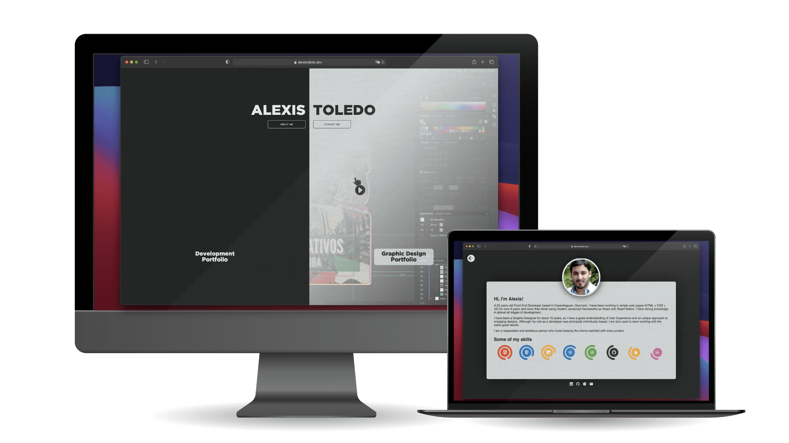
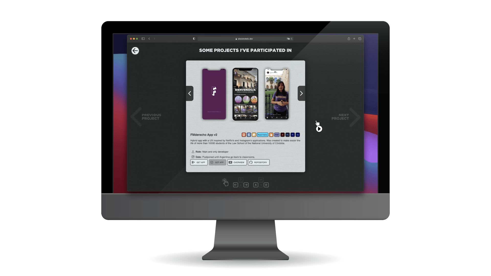
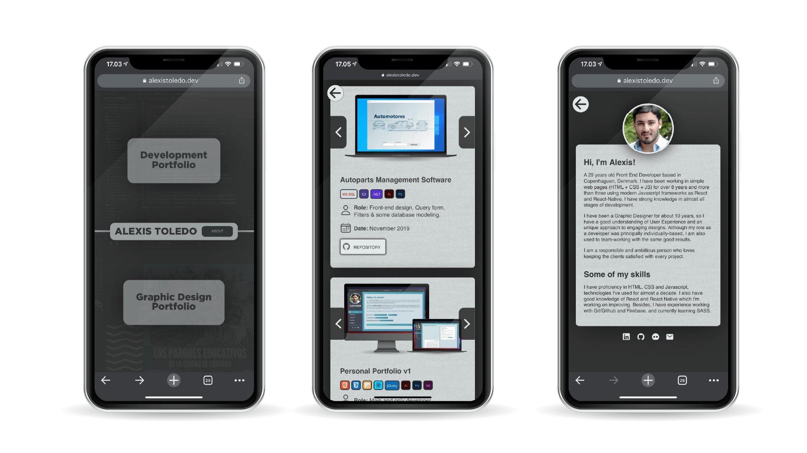

# Alexis Toledo Resume

This is the new version of my Personal Portfolio, a virtual space to show my work in different sections during these years. It is a responsive website made by me using ReactJS. Most of the styles and micreinteractions were written from scratch.

## Built With

-   [ReactJS](https://reactjs.org/)
-   [React Router](https://reactrouter.com/web/guides/quick-start)
-   [Firebase](https://console.firebase.google.com/)
-   [IonIcons](https://ionic.io/ionicons)
-   [React Slidy](https://react-slidy.vercel.app/)

## Live view

[Visit my website!](https://alexistoledo.dev)

## Web

## Mobile

